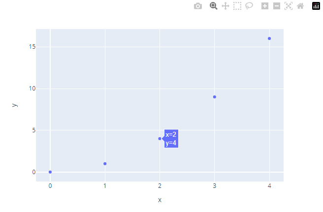
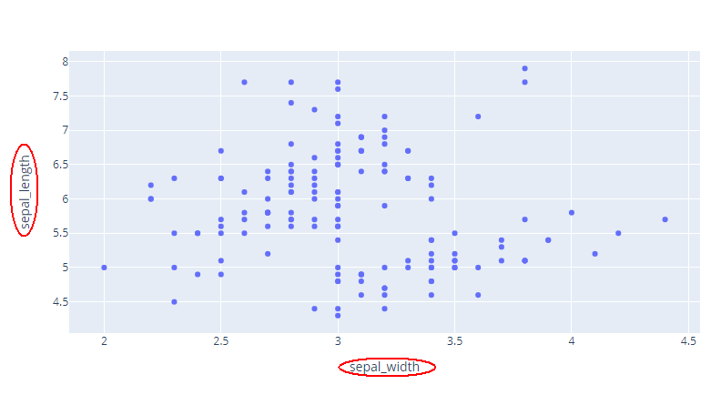
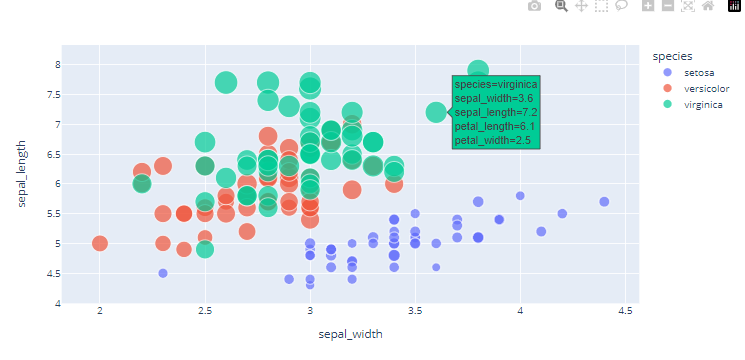
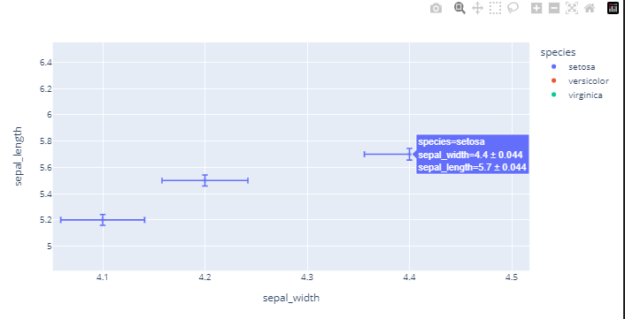
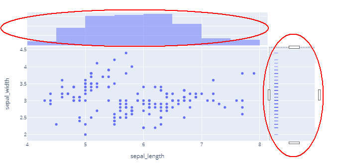
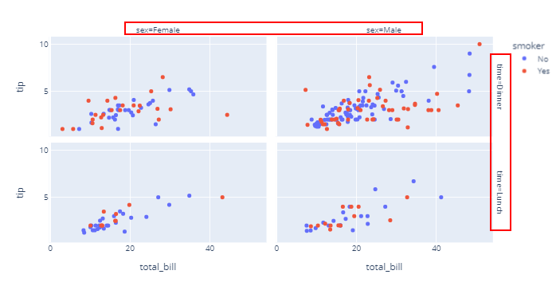

# 基本繪圖

## 目錄
+ [scatter](#scatter)
+ line
+ area
+ bar
+ funnel
+ timeline


## scatter

### 基本語法
```python
import plotly.express as px
fig = px.scatter(x=[0, 1, 2, 3, 4], y=[0, 1, 4, 9, 16])
fig.show()
```
+ 習慣上會將`plotly.express`匯入為`px`。
+ `px.scatter`可以直接傳入`x`和`y`的值，並繪製出散點圖。




### 加上座標軸標籤
```python
import plotly.express as px
df = px.data.iris() 
fig = px.scatter(df, x="sepal_width", y="sepal_length") # 依照DataFrame的欄位名稱指定x和y
fig.show()
```
+ 傳入一個`DataFrame`，並指定`x`和`y`的欄位名稱。
    + 欄位名稱必須要在`DataFrame`的欄位名稱中。




### 使用`size`和`color`調整圖形
```python
import plotly.express as px
df = px.data.iris()
fig = px.scatter(df, x="sepal_width", y="sepal_length", color="species",
                 size='petal_length', hover_data=['petal_width'])
fig.show()
```
+ 此外，使用`hover_data`可以在滑鼠移動到點上時，顯示出該點的資料
    + 但是原本在`x`, `y`, `color`, `size`中指定的欄位，不用指定就會自動顯示



### 進階用法： error bar
```python
import plotly.express as px
df = px.data.iris()
df["e"] = df["sepal_width"]/100 # 設定誤差範圍
fig = px.scatter(df, x="sepal_width", y="sepal_length", color="species",
                 error_x="e", error_y="e")
fig.show()
```
+ 使用`error_x`和`error_y`可以在點上顯示誤差範圍
    + 要是誤差範圍的欄位名稱，而不是數值
+ 可以`error_y_plus`和`error_y_minus`來分別指定誤差範圍的上下界
+ [更多用法](https://plotly.com/python/error-bars/)



### 進階用法： 顯示資料的分佈
```python
import plotly.express as px
df = px.data.iris()
fig = px.scatter(df, x="sepal_width", y="sepal_length", color="species",
                 marginal_x="violin", marginal_y="box")
fig.show()
```
+ 使用`marginal_x`和`marginal_y`可以在圖形的邊緣顯示資料的分佈
    + 可以使用`box`, `violin`, `rug`, `histogram`來顯示不同的分佈圖
        + `box`為箱型圖
        + `violin`為小提琴圖
        + `rug`為細條圖
        + `histogram`為直方圖
    + 也可以使用`None`來不顯示
+ [更多用法](https://plotly.com/python/marginal-plots/)




### 進階用法：維面分解(facet)
```python
import plotly.express as px
df = px.data.iris()
fig = px.scatter(df, x="sepal_width", y="sepal_length", color="species",
                 facet_col="species")
fig.show()
```
+ 使用`facet_col`, `facet_row`可以將資料分成不同的維面
+ [更多用法](https://plotly.com/python/facet-plots/)



### 參數整理
`px.scatter`的參數如下表所示：
+ `data_frame`: 資料集，可以是`DataFrame`或是`dict`。
+ `x`, `y`: 用來指定資料的欄位名稱。
+ `color`: 用來區分資料的欄位名稱。
+ `size`: 用來調整點的大小的欄位名稱。
+ `hover_data`: 滑鼠移動到點上時，顯示的資料欄位名稱。
    + 但是原本在`x`, `y`, `color`, `size`中指定的欄位，不用指定就會自動顯示。
+ `error_x`, `error_y`: 誤差範圍的欄位名稱
    + 可以`error_y_plus`和`error_y_minus`來分別指定誤差範圍的上下界
+ `marginal_x`, `marginal_y`: 用來顯示資料分佈的圖形
    + 可以使用`box`, `violin`, `rug`, `histogram`來顯示不同的分佈圖
    + 也可以使用`None`來不顯示
+ `facet_col`, `facet_row`: 用來將資料分成不同的維面

## line

