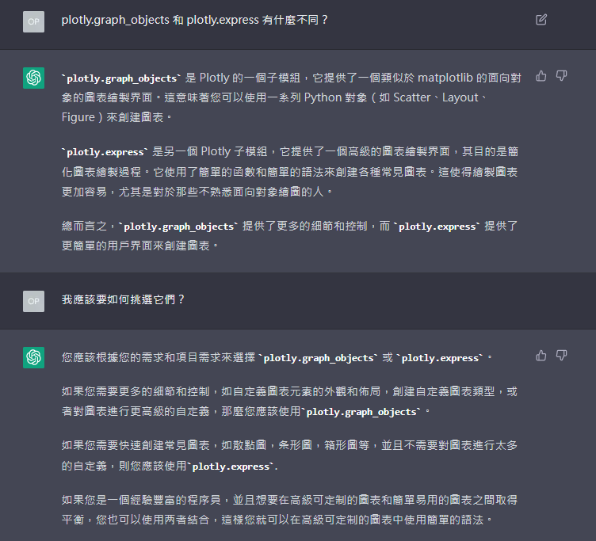

# plotly - 互動式圖表

## 說明
> Plotly Express is a terse, consistent, high-level API for creating figures.  
> ——[Plotly express in Python](https://plotly.com/python/plotly-express/#overview)
+ Plotly Express 是一個簡潔、一致、高階的 API，用於創建圖表。
+ Plotly Graph Objects 是一個低階的 API，用於創建圖表。
+ 提供了超過30種不同的函數，用於創建各種不同類型的圖表。

## 包含的函數
+ **Basics**: scatter, line, area, bar, funnel, timeline
+ **Part-of-Whole**: pie, sunburst, treemap, icicle, funnel_area
+ **1D Distributions**: histogram, box, violin, strip, ecdf
+ **2D Distributions**: density_heatmap, density_contour
+ **Matrix or Image Input**: imshow
+ **3-Dimensional**: scatter_3d, line_3d
+ **Multidimensional**: scatter_matrix, parallel_coordinates, + parallel_categories
+ **Tile Maps**: scatter_mapbox, line_mapbox, choropleth_mapbox, density_mapbox
+ **Outline Maps**: scatter_geo, line_geo, choropleth
+ **Polar Charts**: scatter_polar, line_polar, bar_polar
+ **Ternary Charts**: scatter_ternary, line_ternary

## 疑問與嘗試
+ Plotly Express 和 Plotly Graph Objects 有什麼不同？
    + 
    + `plotly.express` 是一個高階的 API，用於快速創建圖表。
    + `plotly.graph_objects` 擁有更加詳細的控制權。

## 相關資源
+ [Plotly Express in Python](https://plotly.com/python/plotly-express/#overview)
